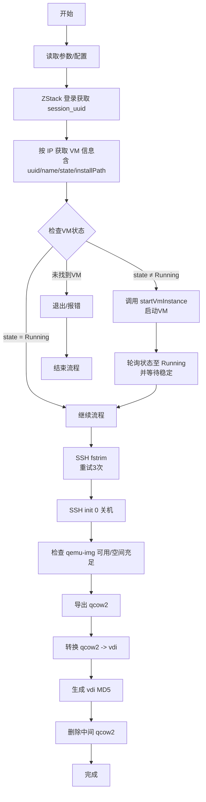

# 导出工具使用说明

---

**zstack_version:5.3.0**

---


## 环境要求
- 需在虚拟化宿主机执行，能直接访问虚拟机磁盘文件（`installPath`）。
- 依赖命令：`ssh`、`sshpass`、`./bin/qemu-img`（需可执行），以及 Python 3。
- qemu 依赖通过 `LD_LIBRARY_PATH=./lib:/opt/qemu-lib` 预加载。
- 工作目录所在挂载点需留有至少 50G 空闲空间，且不小于源盘实际大小。

## export_vdi.py
作用：按 IP 自动完成登录、获取 VM 信息（通过 `q=vmNics.ip=<IP>` 过滤），执行 fstrim、关机、镜像导出与转换（qcow2 -> vdi），并生成 MD5。

配置：
- API 地址、账号密码在文件顶部常量 `HOST/USER_NAME/USER_PASSWORD`，需要时可直接修改（默认指向 localhost）。
- fstrim 使用 `root` 用户，密码默认 `letsg0`，可通过参数覆盖。

用法（产品名可省略，默认取 VM 名称）：
```bash
python export_vdi.py <目标IP> <产品名称> [--ssh-pass 密码]
```
示例：
```bash
python export_vdi.py 10.10.170.25 qdata-7.0.0
python export_vdi.py 10.10.170.25                 # 省略产品名，使用 VM 名称
python export_vdi.py 10.10.170.25 qdata-7.0.0 --ssh-pass mypass
```

流程概要：
1) 登录 ZStack，按 IP（`q=vmNics.ip=<IP>`）查找 VM，获取 `vmInstanceUuid` 与 Root `installPath`。  
2) 若 API state != Running，则调用 `startVmInstance` 启动并等待（含额外等待时间）至 Running 后，通过 sshpass+root 执行 `fstrim /`（失败会重试 3 次、间隔 30s）。  
3) 通过 ssh 在虚机内执行 `init 0` 关机。  
4) 检查 qemu-img 可用与磁盘空间；使用 qemu-img 导出 qcow2、转换为 vdi。  
5) 计算 vdi 的 MD5，保存到同名 `.md5` 文件后，删除中间 qcow2。  

## API 调用整理（export_vdi.py 内使用）
- 登录获取 session：
  - `PUT /zstack/v1/accounts/login`
  - 请求体：`{"logInByAccount":{"password":<sha512(password)>,"accountName":<username>}}`
  - 响应字段：`inventory.uuid` 作为 `session_uuid`

- 按 IP 查询 VM：
  - `GET /zstack/v1/vm-instances?q=vmNics.ip=<IP>`
  - 头：`Authorization: OAuth <session_uuid>`
  - 响应字段：`inventories[0].uuid`（vm uuid），`inventories[0].state`（运行状态），`inventories[0].name`（可作为产品名默认值），`inventories[0].allVolumes[].installPath`（取 type=Root）

- 启动 VM（若 state != Running）：
  - `PUT /zstack/v1/vm-instances/{vmUuid}/actions`
  - 请求体：`{"startVmInstance":{}}`
  - 头：`Authorization: OAuth <session_uuid>`

## 流程图


注意：
- 若输出文件已存在会直接终止，避免覆盖。
- 若源盘或输出路径在不同挂载点，请确保目标挂载点空间充足。

## tools介绍

### 修改zstack kvm初始化配置


---

**zstack_version:5.3.0**

---

**其他版本不确定，不要乱用**

- 修改目的 file 类型的设备 的初始化属性
    - **删除** 'snapshot=external'
    - 保证有 ‘discard=unmap’
    - 磁盘类型修改**virtio** 为 **scsi**
    修改的目的文件
```
/var/lib/zstack/virtualenv/kvm/lib/python2.7/site-packages/kvmagent/plugins/vm_plugin.py
cp file_voleume_scsi.path  /var/lib/zstack/virtualenv/kvm/lib/python2.7/site-packages/kvmagent/plugins/
ce /var/lib/zstack/virtualenv/kvm/lib/python2.7/site-packages/kvmagent/plugins/
patch -p1 < file_voleume_scsi.path 
```


### 主机自带的qemu-img 不一定支持vdi格式。

当前版本仅限支持 **x86_64**
```

cd tools
bash lack.sh
```
